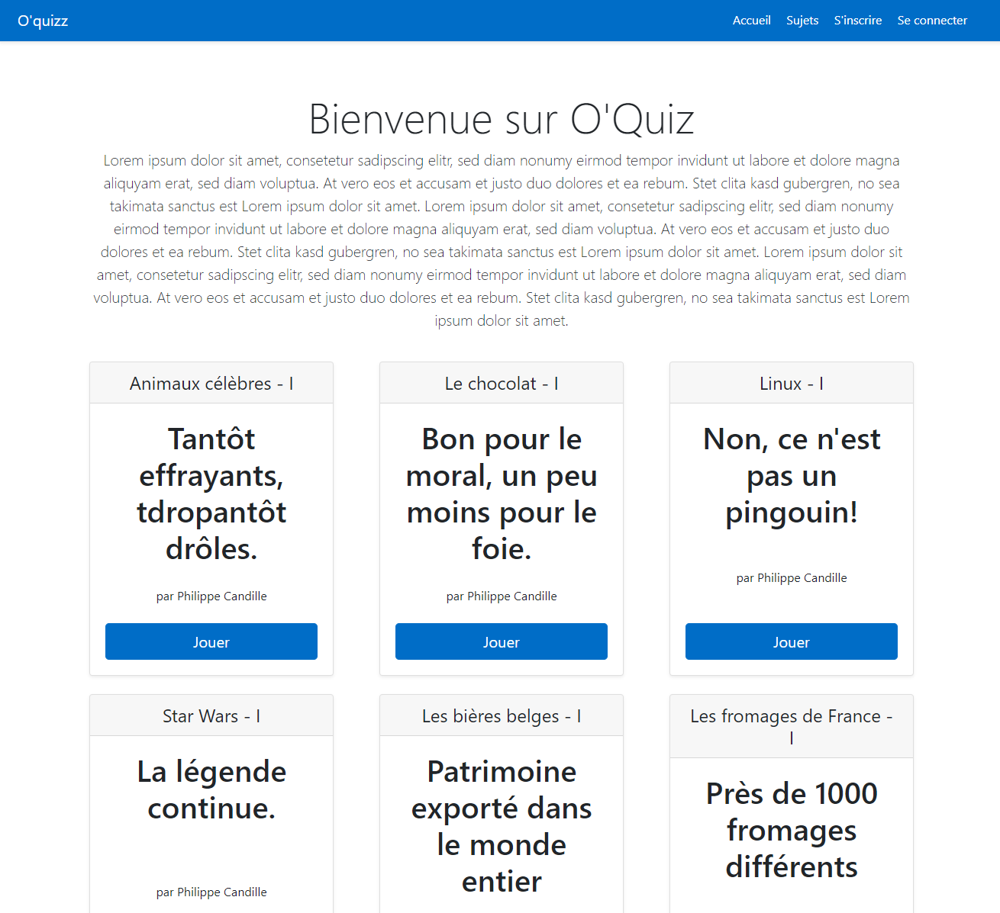
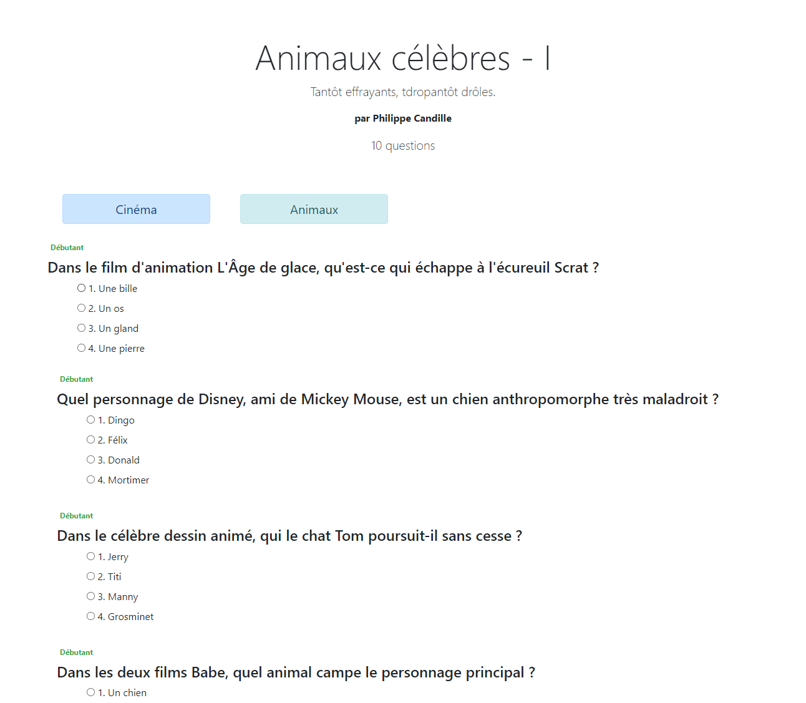
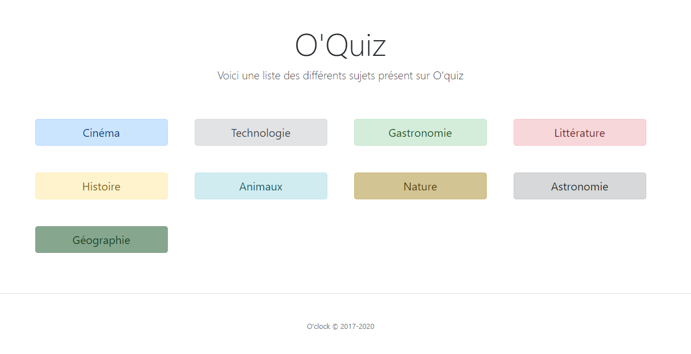
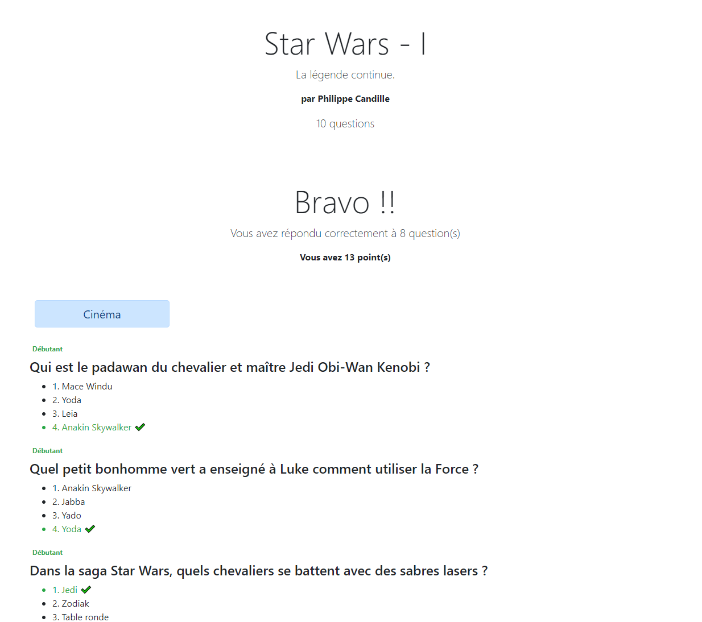
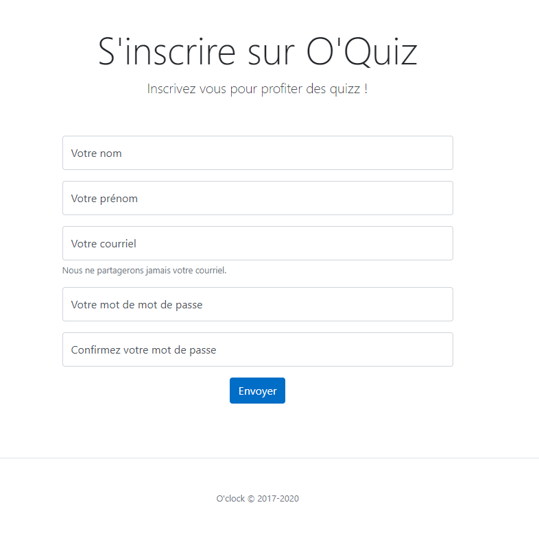
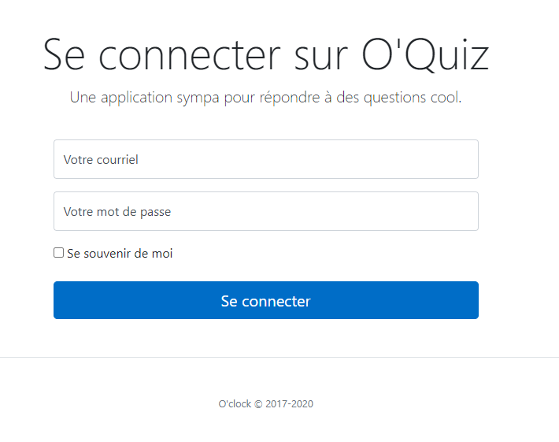

# OQuizz

Quiz O'Clock pour tester ces connaissances sur différents sujets !!

## Outils utilisés

Travail sur une base de données existante, utilisation de Sequelize pour les 
appels à la DB et postgres pour la DB. Développement du back sur NodeJs + express avec EJS pour
les vues dynamiques. Gestion des sessions et des inscription/connexions avec bcrypt, email-validator
et express-session.

### Index Oquiz

### Question Oquiz

### Théme Oquiz

### Résultat Oquiz

### Inscription Oquiz

### Connexion Oquiz

